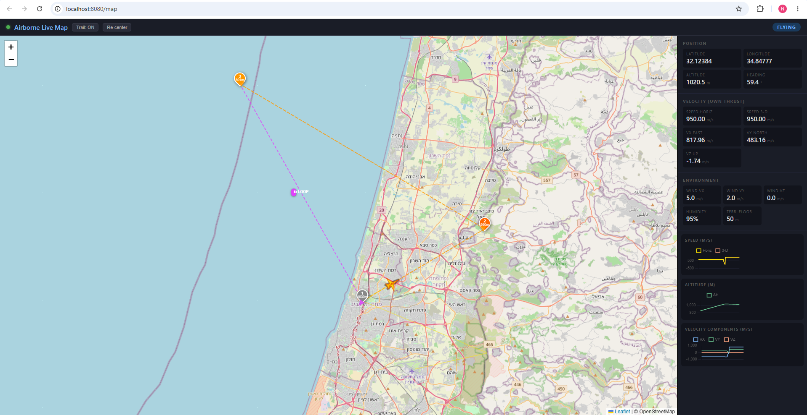

# Airborne – Flight Simulator Backend

A concurrent Go backend that simulates a single aircraft navigating via REST commands.

## Project Structure

```
airborne/
├── main.go                    # Bootstrap, wiring, graceful shutdown
├── simulator/
│   ├── state.go               # AircraftState, Command, Waypoint types
│   ├── environment.go         # Environment interface + Wind/Humidity/Terrain
│   └── simulator.go           # Actor goroutine, tick loop, step function
└── api/
    └── handler.go             # HTTP handlers + SSE streaming
```

## Build & Run

```bash
# Build
go build -o airborne .

# Run (default: listens on :8080)
./airborne

# Or run directly
go run .
```

The server starts with the aircraft positioned at Ben Gurion International Airport
(32.0055°N, 34.8854°E, 500 m altitude), with a default environment of:
- Wind: +5 m/s east, +2 m/s north
- Humidity: 5% performance reduction
- Terrain floor: sea level + 50 m safety margin

## API Endpoints

### GET /health

Check server liveness.

```bash
curl http://localhost:8080/health
# {"status":"ok"}
```

---

### GET /state

Query the current aircraft state snapshot.

```bash
curl http://localhost:8080/state
```

Response:
```json
{
  "lat": 32.0055,
  "lon": 34.8854,
  "alt": 500.0,
  "speed": 97.5,
  "heading": 45.2,
  "vx": 68.9,
  "vy": 69.2,
  "vz": 0.0,
  "timestamp": "2024-01-15T10:30:00.123Z"
}
```

---

### POST /command/goto

Fly to a single target point. Optionally override cruise speed.

```bash
curl -X POST http://localhost:8080/command/goto \
  -H "Content-Type: application/json" \
  -d '{"lat": 32.1, "lon": 34.9, "alt": 1000}'

# With speed override (m/s):
curl -X POST http://localhost:8080/command/goto \
  -H "Content-Type: application/json" \
  -d '{"lat": 32.1, "lon": 34.9, "alt": 1000, "speed": 50}'
```

Response: `202 Accepted`

---

### POST /command/trajectory

Fly a sequence of waypoints. Set `loop: true` for continuous looping.

```bash
curl -X POST http://localhost:8080/command/trajectory \
  -H "Content-Type: application/json" \
  -d '{
    "waypoints": [
      {"lat": 32.1, "lon": 34.9, "alt": 1000},
      {"lat": 32.2, "lon": 35.0, "alt": 1200, "speed": 80},
      {"lat": 32.0, "lon": 35.1, "alt": 800}
    ],
    "loop": false
  }'

# Looping patrol route:
curl -X POST http://localhost:8080/command/trajectory \
  -H "Content-Type: application/json" \
  -d '{
    "waypoints": [
      {"lat": 32.1, "lon": 34.8, "alt": 600},
      {"lat": 32.1, "lon": 35.0, "alt": 600}
    ],
    "loop": true
  }'
```

Response: `202 Accepted`

---

### POST /command/stop

Cancel all motion. Zeroes velocity and discards any active or saved command.

```bash
curl -X POST http://localhost:8080/command/stop
```

Response: `202 Accepted`

---

### POST /command/hold

Pause motion at the current position. The active command is remembered.
Issue a new `goto` or `trajectory` to resume movement from the current position.

```bash
curl -X POST http://localhost:8080/command/hold
```

Response: `202 Accepted`

---

### GET /stream

Server-Sent Events stream of state updates at ~10 Hz. Connect with `curl -N` to
prevent buffering, or use an EventSource in a browser/JS client.

```bash
curl -N http://localhost:8080/stream
```

Each event:
```
data: {"lat":32.0123,"lon":34.8901,"alt":520.3,"speed":97.5,...}

data: {"lat":32.0145,"lon":34.8922,"alt":541.1,"speed":97.5,...}
```

---

### POST /environment

Reconfigure or disable environment effects at runtime — no restart needed.
Each field is optional; **omitting a field disables that effect entirely**.

```bash
# Wind only (turn off humidity and terrain)
curl -X POST http://localhost:8080/environment \
  -H "Content-Type: application/json" \
  -d '{"wind": {"vx": 10, "vy": 0, "vz": 0}}'

# Wind + humidity, no terrain floor
curl -X POST http://localhost:8080/environment \
  -H "Content-Type: application/json" \
  -d '{"wind": {"vx": 5, "vy": 2, "vz": 0}, "humidity": {"factor": 0.9}}'

# All three effects active
curl -X POST http://localhost:8080/environment \
  -H "Content-Type: application/json" \
  -d '{"wind": {"vx": 5, "vy": 2, "vz": 0}, "humidity": {"factor": 0.95}, "terrain": {"ground_elevation": 0}}'

# Disable all effects
curl -X POST http://localhost:8080/environment \
  -H "Content-Type: application/json" \
  -d '{}'
```

Response: `202 Accepted`

The updated environment takes effect on the very next simulator tick. Current
parameters are always visible in the `wind_vx`, `wind_vy`, `humidity_factor`,
and `terrain_floor` fields of `GET /state` and `GET /stream`.

| Field | Constraint |
|-------|-----------|
| `wind.vx` / `vy` / `vz` | any float (m/s) |
| `humidity.factor` | (0, 1] |
| `terrain.ground_elevation` | ≥ 0 (m ASL) |

---

### GET /map



Serves the live browser map (`map.html`). Open it in any browser while the server
is running — no extra setup required.

```bash
# Open in browser (recommended)
start http://localhost:8080/map        # Windows
open  http://localhost:8080/map        # macOS
xdg-open http://localhost:8080/map     # Linux

# Or fetch the raw HTML
curl http://localhost:8080/map
```

**Map features**

| Feature | How to use |
|---------|-----------|
| Live drone icon | Yellow SVG marker that rotates with the aircraft heading, updated at 10 Hz. |
| **Right-click → Fly here** | Right-click anywhere on the map, enter a target altitude when prompted, and the map sends a `POST /command/goto` directly to the server. |
| Trail | Toggle the flight-path trail ON/OFF with the button in the top-right corner. |
| Re-center | Click **Re-center** to snap the view back to the drone. Auto-center re-engages on new data after a manual pan. |
| Sidebar | Three panels: **Position** (lat/lon/alt), **Velocity** (vx/vy/vz + heading), **Environment** (wind, humidity, terrain floor). |
| Live charts | Speed (horizontal + 3D), altitude over time, velocity components (vx/vy/vz). |
| Mode badge | Top-left colour chip: **blue** = flying · **green** = holding · **red** = stopped · **grey** = idle. |

All map interactions use the same REST API documented above — the map is a plain
browser client, not a special protocol.

---

## Validation Rules

| Field | Constraint |
|-------|-----------|
| `lat` | [-90, 90] |
| `lon` | [-180, 180] |
| `alt` | ≥ 0 |
| `speed` | > 0 (if provided) |
| `waypoints` | at least one element |

---

## Assumptions and Tradeoffs

### Coordinate System
- **Flat-earth approximation**: position updates use `1° lat ≈ 111,320 m` and
  `1° lon ≈ cos(lat) × 111,320 m`. Accurate for distances up to ~100 km; for
  longer routes a spherical or WGS-84 model would be needed.

### Tick Rate
- Fixed at **20 Hz** (50 ms tick). Real-time wall-clock `dt` is used each step,
  so the simulation tracks actual elapsed time even if a tick is delayed by the
  scheduler.

### Speed Model
- Default cruise speed: **100 m/s** (~360 km/h). Vertical speed is capped at
  **20 m/s** to avoid unrealistic climbs; total speed is reduced proportionally
  when the climb rate limit would otherwise be exceeded.
- No acceleration/deceleration model: the aircraft moves at target speed
  immediately. This keeps kinematics simple and focuses evaluation on concurrency
  and architecture.

### `hold` vs `stop` Semantics
- `stop`: clears everything – no active command, velocity zeroed.
- `hold`: freezes position – active command discarded from the tick loop but the
  last command is stored. A subsequent `goto` or `trajectory` replaces it and
  resumes from the current (frozen) position.
- There is intentionally **no `/command/resume`** endpoint; a new motion command
  is the natural way to resume after a hold.

### Concurrency
- One goroutine owns all mutable aircraft state (actor model).
- The API layer communicates exclusively via typed channels.
- State queries use the channel-of-channels pattern (no mutexes, no `sync/atomic`).

### Environment Module
- Wind shifts the ground-track velocity after movement computation.
- Humidity scales all velocity components as a simple multiplier.
- Terrain enforces a hard altitude floor with a 50 m safety margin.
- Environments are composable via `MultiEnvironment` and applied in order each tick.
- All environment parameters are hard-coded at startup; a production system would
  expose them via configuration or a dedicated API.

### Terrain Path Intersection Warning
When a `goto` or `trajectory` command is received, the simulator proactively checks
every target waypoint against the terrain safety floor (`GroundElevation + 50 m`).
If any waypoint's altitude is below the floor, a warning is logged immediately —
before the aircraft starts moving — so operators can catch bad commands early.

The warning is advisory: the command is still accepted. The `TerrainEnvironment`
will reactively clamp altitude to the floor during execution.

**How to trigger and verify:**

With default settings the terrain floor is **50 m ASL**. Any target below that altitude
will produce a warning in the server log.

```bash
# Sends alt=10m — below the 50m floor
curl -X POST http://localhost:8080/command/goto \
  -H "Content-Type: application/json" \
  -d '{"lat": 32.1, "lon": 34.9, "alt": 10}'
```

Expected server log output:
```
[terrain-warning] waypoint[0] alt=10.0m is below terrain floor=50.0m
```

For a trajectory with mixed altitudes:
```bash
curl -X POST http://localhost:8080/command/trajectory \
  -H "Content-Type: application/json" \
  -d '{
    "waypoints": [
      {"lat": 32.1, "lon": 34.9, "alt": 600},
      {"lat": 32.2, "lon": 35.0, "alt": 20},
      {"lat": 32.0, "lon": 35.1, "alt": 800}
    ]
  }'
```

Expected log:
```
[terrain-warning] waypoint[1] alt=20.0m is below terrain floor=50.0m
```

The `PathChecker` interface is optional — removing `TerrainEnvironment` from the
environment chain disables the warning without touching any other code.

### Error Handling
- Invalid JSON → `400 Bad Request`.
- Validation failures → `422 Unprocessable Entity` with a descriptive message.
- Commands are accepted asynchronously (`202 Accepted`); there is no callback or
  polling endpoint to confirm execution.
